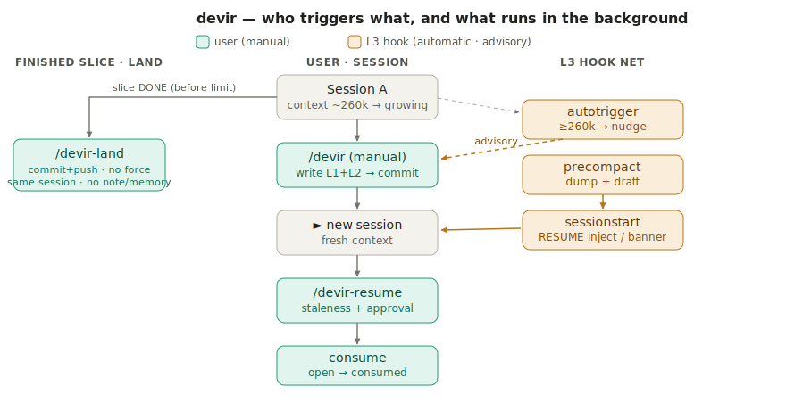
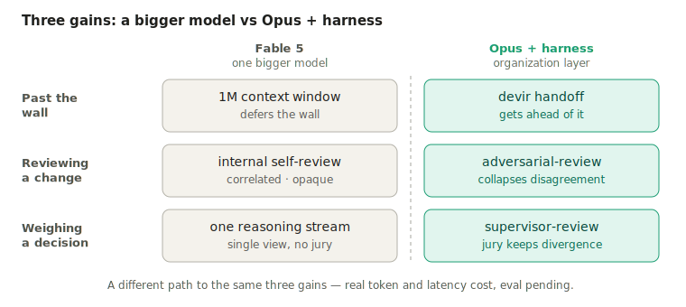

# claude-harness

**English** · [Türkçe](README.tr.md)

**A personal orchestration harness for Claude Code** — hand-built skill / agent / workflow / hook
layers, mirrored from a live `~/.claude/` install. Three subsystems share those layers:

- **devir** — a session-handoff (context-flush) system: it flushes the running session's live state
  to high-fidelity persistent layers (triggered at ~260k tokens, safely ahead of the ~300k
  long-context degradation zone), then lets you open a clean session and **safely resume**.
- **adversarial-review** — multi-axis code review (correctness · security · reuse) where independent
  Opus skeptics try to *refute* each finding; only majority-survivors are reported.
- **supervisor-review** — multi-axis *judgment* of a topic (a decision, plan, or design — not a diff):
  the topic is split into non-overlapping slices, independent Opus evaluators judge each, and
  disagreement is **preserved, not averaged**. The complement to adversarial-review — that one
  collapses disagreement, this one keeps it.

The full picture: [`docs/architecture.md`](docs/architecture.md). Most of this README covers **devir**
(the mature subsystem); the two review subsystems are documented in the architecture doc.

> *devir* (Turkish): the handover of a task to whoever comes next.



*At a glance: left — the `/devir-land` branch off Session A for a finished slice; middle — the
manual `/devir` → new session → `/devir-resume` path; right — the automatic L3 hook net.*

---

## Why

A single Claude Code session degrades in answer quality as it grows (~300k tokens). `devir`
catches this **at ~260k**, before entering the degradation zone. "Just open a new session" is
easy to say, but **context is lost**: where you left off, what was tried and failed, which
decisions were made and why. `devir` writes that state to three layers, so the next session
resumes **from where you left off** — not from scratch.

## Architecture — three layers

| Layer | What | Where it lives | Role |
|-------|------|----------------|------|
| **L1** | Global memory (primary) | `~/.claude/projects/<project>/memory/` | Machine-local continuity; auto-recalled into every session |
| **L2** | Local unique-ID note (opt-in commit) | `<repo>/.claude/docs/devir-notes/<id>.md` | **Local by default** (in global gitignore); an **opt-in commit** (`git add -f`) makes it durable / cross-machine / team-shareable |
| **L3** | Hook safety net | `~/.claude/hooks/devir-*.py` | Mechanical capture/restore with no model cooperation required (advisory) |

L1 + L2 are written by the **model** (the skill); L3 runs **deterministically** (even if the
model ignores it).

## Components

**Skills** (`disable-model-invocation: true` — user-triggered only). The `SKILL.md` /
`DESIGN.md` files are authored in Turkish (the live, working setup); the summaries below are
in English.

- [`skills/devir/SKILL.md`](skills/devir/SKILL.md) — manual `/devir`: capture live git state →
  write L1+L2 → handoff block → **opt-in** commit closure (the L2 note stays **local by
  default**; commit it only for cross-machine/team sharing). Triggered when a **half-done** task
  approaches ~260k. **Key guarantee — promotion gate:** a note is promoted to `open` only if the full
  self-validation checklist passes (goal filled, literal `▶ RESUME` block, non-empty
  tried/failed, decisions, no stray `[TODO]`); otherwise it stays `draft`.
- [`skills/devir-resume/SKILL.md`](skills/devir-resume/SKILL.md) — `/devir-resume`, the "hand-on"
  to `/devir`'s hand-off: in a fresh session, select the right note → staleness (git-drift)
  check (FRESH / SLIGHTLY STALE / STALE) → state what it understood → **get approval** → resume.
  Non-destructive: never deletes, only flips `open → consumed` (reversible). On ambiguity
  (≥2 candidate notes) it **asks** instead of silently choosing.
- [`skills/devir-land/SKILL.md`](skills/devir-land/SKILL.md) — `/devir-land`: land a finished,
  self-contained slice **in the same session**. The pipeline: DONE GATE (test + tsc, verbatim)
  → surgical pathspec staging (never `git add -A/-u`) → trailerless commit → `fetch` +
  rebase-before-push (**no force-push**, retry-once). On conflict, a READ-ONLY Opus supervisor
  subagent classifies it and either auto-applies (SIMPLE, own-files, additive) or escalates for
  approval. **Touches no note or memory** — pure integration; the finished-slice counterpart to
  `/devir`. Rationale: [`skills/devir/DESIGN.md`](skills/devir/DESIGN.md) §7.
- [`skills/adversarial-review/SKILL.md`](skills/adversarial-review/SKILL.md) — `/adversarial-review`:
  a thin trigger over [`workflows/adversarial-review.js`](workflows/adversarial-review.js). Multi-axis
  finders (Sonnet) → independent Opus skeptics try to **refute** each finding → majority-survivors
  only → loop-until-dry. Advisory, human-in-the-loop (no auto-fix). See
  [`docs/architecture.md`](docs/architecture.md).
- [`skills/supervisor-review/SKILL.md`](skills/supervisor-review/SKILL.md) — `/supervisor-review`:
  a thin trigger over [`workflows/supervisor-review.js`](workflows/supervisor-review.js). Judges a
  **topic** (decision / plan / design / strategy — not a diff): pick one axis → split into
  non-overlapping slices → independent Opus evaluators per slice (high-stakes slices run 2×) →
  **preserve** disagreement (never average) → synthesize one decision artifact
  (go / go-with-conditions / no-go / needs-more-info). The judgment complement to adversarial-review.

**Agents** (`agents/*.md` — subagent prompts with `name`/`model`/`tools`; model-per-role):

- [`agents/reviewer-correctness.md`](agents/reviewer-correctness.md),
  [`reviewer-security.md`](agents/reviewer-security.md),
  [`reviewer-reuse.md`](agents/reviewer-reuse.md) — read-only finders (Sonnet), one per review axis.
- [`agents/skeptic-verifier.md`](agents/skeptic-verifier.md) — adversarial verifier (Opus) that tries
  to refute a single finding; uncertainty ⇒ refuted (kills false positives).
- [`agents/decomposer.md`](agents/decomposer.md), [`slice-evaluator.md`](agents/slice-evaluator.md) —
  supervisor-review roles (Opus): the decomposer picks the axis and cuts the non-overlapping slices;
  the slice-evaluator judges one slice against only its own questions (reused for both the 1× and 2× runs).

**Workflows** (`workflows/*.js` — deterministic orchestration; the heavy logic lives here):

- [`workflows/adversarial-review.js`](workflows/adversarial-review.js) — scope → find (×3 axes) →
  dedup → verify (×N skeptics, majority vote) → loop-until-dry → Opus synthesis. Model-per-role via
  the agent files' frontmatter.
- [`workflows/supervisor-review.js`](workflows/supervisor-review.js) — frame (decomposer) → evaluate
  (slice-evaluator ×depth, parallel) → reconcile (deterministic: capture divergence, never average)
  → Opus synthesis into a decision artifact. All evaluators Opus; cost-aware (slices/depth clamp to budget).

**Hooks** (L3, all defensive: every error → exit 0, never breaks the session/compaction):

- [`hooks/devir-autotrigger.py`](hooks/devir-autotrigger.py) — `UserPromptSubmit`: at the
  ~260k token threshold, advises running `/devir` (advisory nudge + refire guard).
- [`hooks/devir-precompact.py`](hooks/devir-precompact.py) — `PreCompact`: just before
  compaction, a mechanical state dump + a git-tracked `draft` note (with redaction).
- [`hooks/devir-sessionstart.py`](hooks/devir-sessionstart.py) — `SessionStart`: on `compact`,
  RESUME auto-inject; on `startup`/`resume`, a status banner.
- [`hooks/devir_common.py`](hooks/devir_common.py) — shared helpers (git, note
  scanning/precedence, redaction, transcript token/file extraction).
- [`hooks/devir_memory.py`](hooks/devir_memory.py) — `flock` + atomic + idempotent upsert into
  the `MEMORY.md` index (parallel-session race protection).

**Tests:** [`hooks/devir_e2e_test.py`](hooks/devir_e2e_test.py) — end-to-end regression
(**49/49**) driving the real hooks with simulated harness payloads in a throwaway git repo.
[`tools/check_doc_sync.py`](tools/check_doc_sync.py) guards constant-, hook-wiring-, skill-name-,
and agent-wiring drift between code and docs (**24 checks**).

```bash
python3 hooks/devir_e2e_test.py
python3 tools/check_doc_sync.py
```

## Design rationale

### Opus, not Fable? You don't have to mourn it

Fable 5 is a real frontier model — bigger context, higher raw capability. This harness does **not**
replicate it and doesn't claim to. But the three things a stronger model buys you, it gives back
through *organization* rather than raw power:



- **Past the context wall — `devir`.** Fable's 1M-token window *defers* long-context degradation; it
  doesn't remove it (the decline around ~250–300k is structural, not a weak-model artifact). On Opus,
  devir gets *ahead* of the wall with a high-fidelity handoff — a model-independent answer to the
  same problem.
- **Reviewing a change — `adversarial-review`.** A top model self-reviewing at high effort re-reads
  the *same* draft in the *same* context, so its errors stay correlated and the pass is opaque. The
  harness rebuilds that rigor *externally*: independent finders in fresh contexts (decorrelated error)
  → Opus skeptics that try to refute each finding → a majority vote that *collapses* disagreement to
  kill false positives. Inspectable at every step.
- **Weighing a decision — `supervisor-review`.** For an open-ended judgment (a plan, a design, a
  strategy — not a diff), one reasoning stream weighs the angles in a single context. The harness
  convenes an actual *jury*: the topic is split into non-overlapping slices, each judged by
  independent Opus evaluators, and where two diverge the disagreement is **preserved, not averaged** —
  on a judgment call the divergence *is* the signal. The complement to adversarial-review: that one
  collapses disagreement, this one keeps it.

The lever is skill + hook + workflow *organization*, not model size — the same orchestrator-worker
pattern frontier vendors recommend building *on top of* their models, here built by hand, fail-safe
and continuity-aware.

**Honestly:** this is not "Opus + harness = Fable." Orchestration buys reliability, judgment quality
and inspectability at a real cost — multiplicative tokens (a 2× jury slice doubles again), added
latency — and pays off only for high-stakes, decomposable, verifiable work. The reviews' gain over a
single pass isn't eval-proven yet. Full source-cited account, including what is *not* claimed:
[`docs/fable-comparison.md`](docs/fable-comparison.md).

**Long-context degradation is a tendency, not a weak-model problem.** However capable the model,
context efficiency tends to decline as a session grows into the ~250–300k range — a pattern
widely seen in long-context evaluations. A larger context window (e.g. Fable's 1M tokens)
*defers* this; it doesn't eliminate it. devir gets ahead of that wall for tools like Claude Code
running on Opus — flushing early (around the ~260k mark) and turning an unavoidable limit into a
controlled, high-fidelity handoff instead of a lossy auto-compaction.

**Human-in-the-loop, by design.** A single powerful command can finish a complex task
end-to-end — but intervening mid-run is hard, especially when you want a say in how much
documentation or process detail the run surfaces. devir exposes natural checkpoints instead:
approval before commit/push, ask-on-ambiguity on resume, a staleness check before continuing,
and reviewable artifacts (the handoff note, the supervisor verdict) at every step — so you stay
in the loop without fighting the tool. (These checkpoints are structural; whether they
*measurably* improve outcomes across workflows is still an open question.)

For the full, evidence-based comparison with Anthropic Fable — including an honest account of
what is **not** claimed (no eval yet, unmeasured cost/latency) — see
[`docs/fable-comparison.md`](docs/fable-comparison.md) *(Turkish)*.

## Install

This repo is a **snapshot**; the source of truth is your working install at `~/.claude/`.

```bash
# from the repo root
cp -R skills/.    ~/.claude/skills/      # /devir(+resume/land/archive), /adversarial-review, /supervisor-review
cp    hooks/*.py  ~/.claude/hooks/       # L3 hook net + shared libs
cp -R agents/.    ~/.claude/agents/      # subagent prompts (review finders, skeptic, decomposer, slice-evaluator)
cp -R workflows/. ~/.claude/workflows/   # orchestration (adversarial-review.js, supervisor-review.js)
# then merge the "hooks" block of settings.example.json into ~/.claude/settings.json
# L2 note privacy (opt-in commit): keep devir notes local by default across all projects
echo '**/.claude/docs/devir-notes/' >> ~/.config/git/ignore   # commit a note explicitly with: git add -f
python3 ~/.claude/hooks/devir_e2e_test.py   # verify: 49/49
```

Hook wiring lives in [`settings.example.json`](settings.example.json) (`UserPromptSubmit` /
`PreCompact` / `SessionStart`).

> Sync note: changes are made in `~/.claude/`, then copied into this repo and committed.
> (A symlink or one-way sync script could keep them in lockstep in the future.)

## Documentation

The deep docs are currently in Turkish (the operational skills are authored in Turkish, which
is the live, working setup):

- [`docs/architecture.md`](docs/architecture.md) *(Turkish)* — the umbrella: the four layers
  (skills / agents / workflows / hooks) and how the **devir**, **adversarial-review** and
  **supervisor-review** subsystems share them.
- [`docs/workflow.md`](docs/workflow.md) *(Turkish)* — the full devir workflow: who triggers what and
  when, what runs in the background and why (with diagrams).
- [`docs/fable-comparison.md`](docs/fable-comparison.md) *(Turkish)* — an honest, evidence-based
  comparison of this orchestration approach with Anthropic Fable.
- [`docs/diagrams/`](docs/diagrams/) *(Turkish)* — standalone SVG diagrams + the
  **diagram-update discipline** ([`docs/diagrams/README.md`](docs/diagrams/README.md)).

Türkçe sürüm / Turkish version: **[README.tr.md](README.tr.md)**.

## License

[MIT](LICENSE) © 2026 İbrahim Sümbül.
