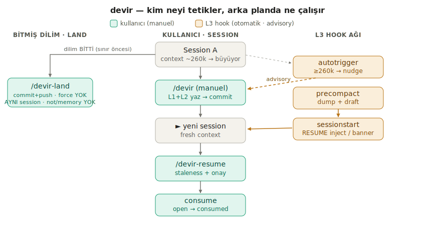
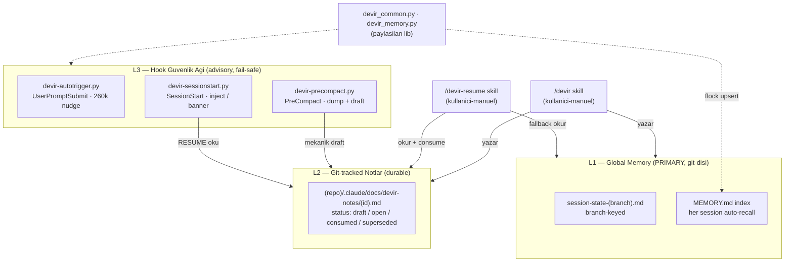
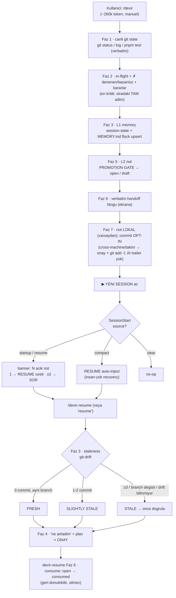
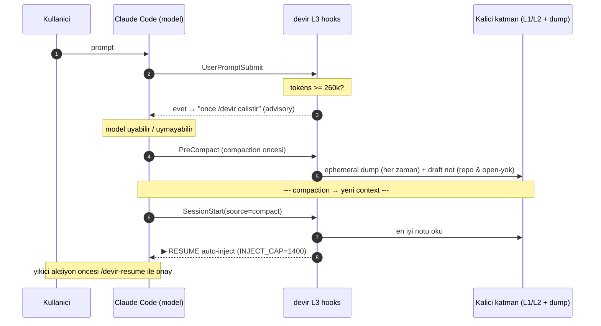

# devir — Workflow & Tetikleme Haritası

Bu doküman sistemin **çalışma prensibini** anlatır: kullanıcı neyi/ne zaman/nasıl
tetikler, arka planda hangi mekanizma ne zaman ve **neden** çalışır. Tüm değerler
çalışan koddan alınmıştır (dosya:satır referanslı).

> Mimari gerekçeler ve alternatif değerlendirmeleri: [`../skills/devir/DESIGN.md`](../skills/devir/DESIGN.md).



*Tek-bakışta özet: solda kullanıcının manuel tetiklediği yol, sağda otomatik L3 hook ağı.
Standalone SVG: [`diagrams/devir-trigger-flow.svg`](diagrams/devir-trigger-flow.svg). Aşağıdaki
Mermaid diyagramlar GitHub'da render olur ve detayı taşır.*

---

## 1. Üç katman, tek cümlede

| Katman | Nedir | Yazıcı | Yer |
|--------|-------|--------|-----|
| **L1** | Global memory (birincil süreklilik) | `/devir` skill | `~/.claude/projects/<proj>/memory/` (git-dışı, makine-local) |
| **L2** | Lokal unique-ID not (opt-in commit ile durable/cross-machine) | `/devir` skill | `<repo>/.claude/docs/devir-notes/<id>.md` (varsayılan **lokal**; opt-in commit) |
| **L3** | Hook güvenlik ağı (advisory; model işbirliği gerektirmez) | deterministik | `~/.claude/hooks/devir-*.py` |

**Tasarım ilkesi:** L1 tek-session sürekliliğini tek başına çözer; L2 yalnızca
*cross-machine taşıma* ve *paralel-branch ayrıştırma* için hak ediyor. Bu yüzden L2 notu
**varsayılan olarak commit EDİLMEZ** (solo tek-makinede L1 yeterli; public repo'da iç-state
sızıntısı) — git'e girmesi **opt-in** (`git add -f`). L3, kullanıcı/model manuel `/devir`'i
kaçırırsa devreye giren ağdır — **zorlayıcı değil, advisory**.

---

## 2. Mimari



L1+L2'yi **model** (skill) yazar; L3 **deterministik** çalışır (model uymasa bile).

---

## 3. Tam yaşam döngüsü (uçtan uca)



> Diyagram yüksek-seviye: **Faz 4 (CLAUDE.md, ikincil — varsa)** sadeleştirme için elendi;
> kritik state zaten Faz 3'te L1'de. Faz numaraları iki ayrı skill'e ait — `/devir` yazar
> (Faz 0-7), `/devir-resume` okur/consume eder (Faz 1-6).

**Yazma etkisi (özet):** L1 (session-state + topic dosyaları) + L2 (`<id>.md`) yazılır →
`MEMORY.md` flock-upsert → git commit kapanışı → kullanıcı **fresh session** açar.

---

## 4. Tetik tablosu (A) — KULLANICI TETİKLER

| Kullanıcı ne yapar | Ne çalışır | Ne zaman / koşul |
|--------------------|-----------|------------------|
| `/devir` yazar | `devir` skill (Faz 0-8: state yakala → L1+L2 → handoff → commit) | İstendiğinde, ~260k civarı. Model **otomatik çağıramaz** (`disable-model-invocation: true`). |
| `/devir-resume` (veya "resume", "kaldığımız yerden devam", "hand on") | `devir-resume` skill (not seç → staleness → özet → çoklu ise SOR → onayla → uygula) | Fresh session başında, devam etmek için. Manuel-only. |
| Herhangi bir prompt gönderir | `devir-autotrigger.py` (UserPromptSubmit) önce çalışır | Her prompt; yalnızca transcript ≥260k ise ve refire penceresi izin veriyorsa nudge enjekte eder. |
| `/compact` (manuel compaction) | `devir-precompact.py` (`trigger=manual`) → sonra `devir-sessionstart.py` (`source=compact`) | Manuel compaction'da: dump + draft yazılır, sonra RESUME geri enjekte edilir. |
| Model-invocable skill çağırır (`/code-review`, `/simplify`, `/verify`, …) | İlgili skill | İsimle veya modelin trigger eşleşmesiyle (devir-dışı skill'ler). |

## 5. Tetik tablosu (B) — ARKA PLANDA OTOMATİK

| Olay | Mekanizma | Ne zaman | Neden |
|------|-----------|----------|-------|
| Token ~260k'yı aşar | `devir-autotrigger.py` (UserPromptSubmit) `additionalContext` enjekte eder | Prompt'ta, transcript ≥260k ve bu session'da daha önce ateşlenmediyse (veya +20k birikti) | ~300k degradation bölgesinden önce temiz `/devir` devri öner. **Advisory — skill'i zorlayamaz** (Anthropic #43733). |
| Compaction başlamak üzere | `devir-precompact.py` (PreCompact) | Her compaction'dan hemen önce | Model işbirliği **gerekmeden** canlı git state'i koru: her zaman ephemeral dump + (repo varsa & `open` not yoksa) git-tracked **draft** not. Advisory nudge'ın boşluğunu kapatır. |
| Compaction sonrası yeni context | `devir-sessionstart.py` (`source=compact`) | Compaction fresh context üretince | İnsan-yok recovery: en iyi notun `▶ RESUME`'unu auto-inject (yoksa ephemeral dump). Çoklu branch açık not varsa **otomatik seçmez**, `/devir-resume` der. |
| Session startup / resume | `devir-sessionstart.py` (`source=startup`/`resume`) | Session başlar/devam ederken (`clear` değil) | Durum banner'ı: worktree için açık not sayısı. 1 → RESUME özeti + `/devir-resume` öner; ≥2 → **SOR** (sessizce seçmez/consume etmez). |
| Her session (bu proje) | Auto-memory recall (hook değil — harness özelliği) | Session başında | `MEMORY.md` index context'e enjekte; tekil memory dosyaları alaka ile okunur. **Birincil (L1) süreklilik.** |
| Eski marker birikimi | `cleanup_old_markers()` (autotrigger içinde) | Bir UserPromptSubmit ateşlemesine binerek | `.devir-state/`'te 7 günden eski `.fired`/`.consumed.md`/`.dump.md` marker'larını sil → sınırsız büyümesin. |

> **Yan yana koşan, devir-dışı hook'lar:** Aynı `settings.json`'da başka sistemlere ait
> devir-dışı hook'lar (ör. `SessionStart` / `Stop` / `PostToolUse`'a bağlı bir telemetri)
> bulunabilir. Bunlar devir ile ilgisizdir, context enjekte etmez ve bu repoya
> vendor'lanmamıştır; yalnızca `SessionStart` event'ini devir ile paylaştıkları için
> burada not edilir (settings birleştirirken üzerine yazılmamalı).

---

## 6. Tetik akışı (güvenlik ağı zaman çizgisi)



---

## 7. Bileşen bazında: trigger · ne zaman · neden

| Bileşen | Trigger tipi | Ne zaman | Neden var |
|---------|-------------|----------|-----------|
| `/devir` skill | **kullanıcı-manuel** (`disable-model-invocation: true`) | ~260k'da elle | Yüksek-fidelity flush. Yalnız model gerçek "sıradaki adım"ı, denenen/başarısız ve kararları üretebilir. |
| `/devir-resume` skill | **kullanıcı-manuel** | Fresh session başı | Güvenli devam: doğru notu seç, anladığını doğrula, belirsizlikte SOR, yıkıcı aksiyon öncesi onay. |
| `devir-autotrigger.py` | **hook: UserPromptSubmit** | tokens ≥ 260k & refire izinli | Degradation öncesi advisory nudge. Zorlayamaz → deterministik ağ ayrı. |
| `devir-precompact.py` | **hook: PreCompact** (`manual`/`auto`) | Compaction'dan hemen önce | İşbirliği gerekmeden mekanik yakalama: dump (her zaman) + draft (repo & open-yok). Her hata → exit 0 (compaction'ı kırmaz). |
| `devir-sessionstart.py` | **hook: SessionStart** (`source`-keyed) | Yeni context | `compact`→RESUME inject; `startup`/`resume`→banner; `clear`→no-op. |
| `devir_common.py` | (kütüphane) | 3 hook import eder | Defensive paylaşılan: token tahmini, git, not tarama/precedence, redaction, worktree-match. |
| `devir_memory.py` | **kullanıcı-manuel** (Faz 3'ten çağrılır) | MEMORY.md index upsert | flock + atomik + idempotent (paralel-session race koruması). |

---

## 8. Sabitler / eşikler (koddan)

| Sabit | Değer | Kaynak | Anlam |
|-------|-------|--------|-------|
| `THRESHOLD` | `260_000` | `autotrigger.py:18` | `/devir` tetik eşiği (~300k degradation öncesi; gözlem: 282k spike) |
| `REFIRE_GAP` | `20_000` | `autotrigger.py:19` | İlk nudge yok sayılırsa +20k token sonra tekrar (anti-nag) |
| `CLEANUP_DAYS` | `7` | `autotrigger.py:20` | `.devir-state` marker temizliği |
| `NOTE_FRESH_HOURS` | `6` | `autotrigger.py:21` | Bu süre içinde taze not yoksa "not oluştur" hatırlat |
| `INJECT_CAP` | `1_400` | `sessionstart.py:23` | Enjekte edilen `additionalContext` max karakter |
| `STATUS_RANK` | `{draft:0, open:1, consumed:2, superseded:-1}` | `devir_common.py:25` | Resume precedence |
| `DEFAULT/WIDE_WINDOW` | `262_144` / `1_048_576` | `devir_common.py:17-18` | Transcript kuyruk okuma penceresi |
| `--max-lines` | `200` | `devir_memory.py:126` | Index ≤200 satır (her session yüklenir); uyarır, sessizce kesmez |

**Token tahmini notu:** `latest_usage_tokens()` **son** usage satırını alır (max değil) →
compaction sonrası eski yüksek değerle mis-fire/şişme olmaz (`devir_common.py:224-248`).

---

## 9. Tasarım kararları (neden böyle?)

- **Advisory, gate değil.** Hook bir shell komutu; modeli zorla skill çalıştıramaz
  (Anthropic #43733). Bilinçli "BEHIND" konum — enforcement platform-limitli, bu yüzden
  deterministik ağ (precompact + sessionstart) ayrı ve best-effort. Her hook her hatada
  exit 0 → asla compaction/prompt kırmaz.
- **Non-destructive.** Stale fact düzeltilir, göreli→mutlak tarih; merge/delete YOK →
  adaylar `⚠ Reconcile`'a, riskli kısım fresh session'da `/consolidate-memory`. `consumed`
  geri-dönülebilir flip; silme her zaman kullanıcı kararı.
- **flock + atomik + idempotent index.** `MEMORY.md` tek paylaşımlı, git-dışı dosya →
  gerçek paralel-session race. `devir_memory.py` read-modify-write'ı `flock` ile serialize
  eder, temp+`os.replace` ile atomik yazar, key-bazlı idempotent upsert yapar (duplicate yok).
  Multi-line `--line` reddedilir; `--max-lines` aşılırsa uyarır, sessizce **truncate etmez**.
- **Secret redaction (opt-in raw).** Ham mesaj yakalama default KAPALI (gizlilik); redaction
  her zaman açık. `last_messages()` **cap'ten ÖNCE** tam metni redact eder → sınır-aşan secret
  sızmaz. Pattern seti: env/key-value, bearer, provider prefix'leri (sk/ghp/xox…/sbp/glpat),
  AWS AKIA, Google AIza, JWT, URL-gömülü cred, PEM blokları.
- **Fence-aware section extraction.** `extract_section()` ` ``` ` fence takip eder: fence
  içindeki `#` markdown başlık değil, shell yorumudur → RESUME'un `# İlk aksiyon:` satırını
  kesmez. (Bu, E2E test sırasında bulunup düzeltilen gerçek bir prod bug'ıydı.)
- **Promotion gate.** Not yalnızca checklist self-validate'ten geçince `open`'a yükselir
  (Hedef / literal RESUME / non-empty denenen / kararlar / `[TODO]` yok); aksi halde `draft`.
- **Staleness ref-guard.** `covers_since` gerçek commit ref mi diye `^{commit}` ile doğrulanır;
  note-id / "session start" ref değildir → 0-drift sanılmaz; başarısız git komutu "drift
  bilinmiyor" (→STALE) olur, asla yutulup FRESH sanılmaz.
- **Worktree/branch-keyed izolasyon.** L1 branch-keyed (paralel branch'ler ayrı dosya);
  L2 unique-ID dosyalar (merge'de additive, çakışmasız). Resume/banner'da **worktree-match
  birincil filtre** (`under_worktree` realpath-normalize → `/var↔/private/var` symlink'i atlar).
